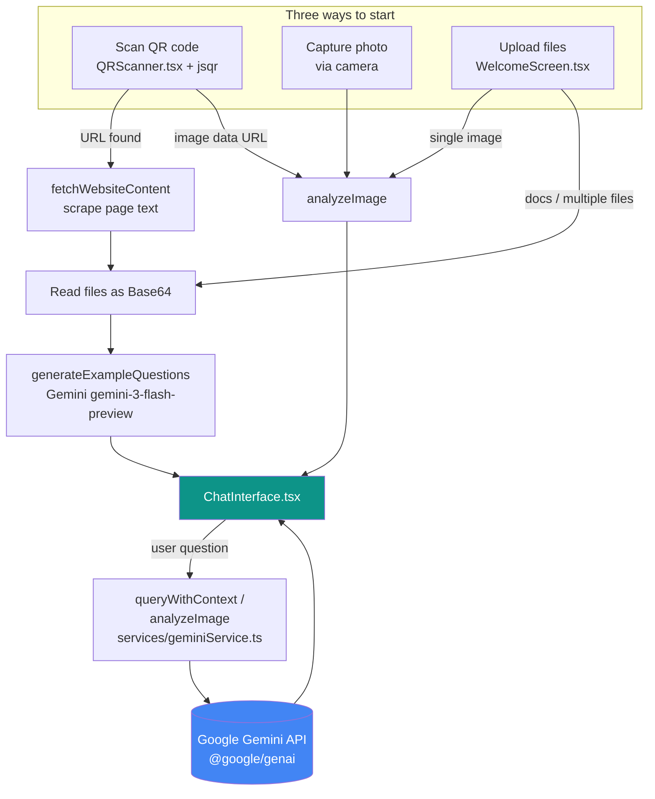

<div align="center">

</div>

# Click and Ask

Scan a QR code, upload a document, or snap a photo — then ask Gemini AI questions about it, instantly.

## Overview

Click and Ask is a small experiment/prototype web app (built via Google AI Studio) that lets a user point a camera at a QR code, upload a file, or take a photo, and immediately start a chat conversation about that content, powered by Google's Gemini API. It is designed as a lightweight demo of Gemini's large-context-window "RAG-like" behavior: instead of a traditional vector-database RAG pipeline, the app sends the raw file(s) directly to Gemini alongside the chat history and lets the model's own context window do the retrieval.

Three ways in:
- **Scan** a QR code with the device camera to pull up a linked page or piece of text
- **Upload** one or more documents/images (PDF, TXT, MD, or images)
- **Capture** a photo directly from the camera for instant visual analysis

Once content is loaded, the app opens a chat interface where the user can ask free-form questions about what was scanned or uploaded.

View the original app in AI Studio: https://ai.studio/apps/drive/1B8jUrB4DkaFDHT_AMmECGBNlQ_k06x_T

## Key features

- **QR code scanning** — live camera feed decoded client-side with `jsqr`; scanning a QR code that resolves to a URL triggers a lightweight scrape of that page's text content
- **Photo capture & analysis** — capture a photo from the scanner (or upload a single image) for direct Gemini vision analysis, no document context needed
- **Multi-file upload & chat** — upload multiple documents/images at once; per-file upload progress with cancel support, then chat against all of them together
- **Auto-generated example questions** — after upload, Gemini suggests three starter questions based on the actual file content
- **Conversational follow-ups** — chat history is preserved and re-sent with each new question, so follow-up questions stay in context
- **PWA support** — installable, with a service worker (`sw.js`) caching the app shell for offline-first loading
- **Client-side only** — no backend server; the browser talks directly to the Gemini API using the visitor's own API key

## Tech stack

| Layer | Choice |
|---|---|
| Framework | React 19 (function components + hooks) |
| Language | TypeScript |
| Build tool | Vite 6 |
| Styling | Tailwind CSS (loaded via CDN `<script>`, configured inline in `index.html`) |
| AI | Google Gemini API via `@google/genai` (`gemini-3-flash-preview` for chat/text, `gemini-3-pro-preview` for image analysis) |
| QR decoding | `jsqr` (pure JS, runs on camera frames drawn to a `<canvas>`) |
| Module loading | Native browser import maps (React/Gemini/jsqr resolved from `aistudiocdn.com`/`esm.sh` at runtime, in addition to being listed in `package.json`) |
| PWA | Custom service worker + `manifest.json` |

There is no backend, database, or server-side code — this is a static single-page app that calls the Gemini API directly from the browser.

## Architecture



App state is a single status machine in `App.tsx` (`AppStatus`: Initializing → Welcome → Scanning/Uploading/Scraping → Chatting/ImageAnalysis, with an Error state), driving which screen renders.

### Project structure

```
App.tsx                 Root component: state machine, Gemini API key handling, routing between screens
index.tsx               Entry point, mounts React app, registers service worker
index.html              HTML shell, Tailwind CDN config, import map for CDN-hosted deps
manifest.json           PWA manifest
sw.js                   Service worker (app-shell caching)
types.ts                Shared TypeScript types (AppStatus, ChatMessage, FileData, etc.)
services/
  geminiService.ts      All Gemini API calls: queryWithContext, analyzeImage,
                         generateExampleQuestions, fetchWebsiteContent
components/
  WelcomeScreen.tsx      Landing screen: scan / upload entry points
  QRScanner.tsx          Camera feed + jsqr QR decoding + photo capture
  UploadProgressView.tsx Per-file upload progress with cancel
  ChatInterface.tsx      Chat UI + message history + example questions
  Spinner.tsx            Loading indicator
  icons/                 Small inline SVG icon components
```

Note: a few components in `components/` (`DocumentList.tsx`, `ImageEditor.tsx`, `ProgressBar.tsx`, `QueryInterface.tsx`, `RagStoreList.tsx`, `UploadModal.tsx`) are not imported anywhere in the current app flow — they appear to be earlier scaffolding from AI Studio generation and can likely be ignored or removed in future cleanup.

## Setup & installation

**Prerequisites:** Node.js (any recent LTS version) and a [Gemini API key](https://aistudio.google.com/apikey).

1. Clone the repo and install dependencies:
   ```
   git clone https://github.com/srksourabh/Click-Ask.git
   cd Click-Ask
   npm install
   ```
2. Create a `.env.local` file in the project root and set your key:
   ```
   GEMINI_API_KEY=your_api_key_here
   ```
   (Vite injects this into the app at build time via `vite.config.ts`.)
3. Run the dev server:
   ```
   npm run dev
   ```
   The app runs on `http://localhost:3000` (configured in `vite.config.ts`).

Other available scripts (from `package.json`):
- `npm run build` — production build (output to `dist/`)
- `npm run preview` — preview the production build locally

Camera access (for QR scanning and photo capture) requires the browser to be served over HTTPS or `localhost`.

## Usage

1. Open the app and select/confirm your Gemini API key when prompted.
2. Choose one of:
   - **Scan** — point the camera at a QR code, or tap the capture button to analyze a photo directly.
   - **Upload** — pick one or more files (PDF, TXT, MD, or images).
3. For a single image, the app jumps straight into an image-analysis chat. For documents (or multiple files), the app uploads them, generates three example questions, then opens the chat.
4. Ask questions in the chat box — answers are grounded in the uploaded/scanned content, and follow-up questions keep prior chat history for context.
5. Use "New chat" to reset and start over with new content.
